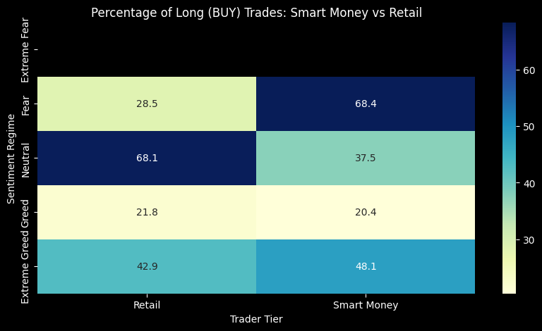
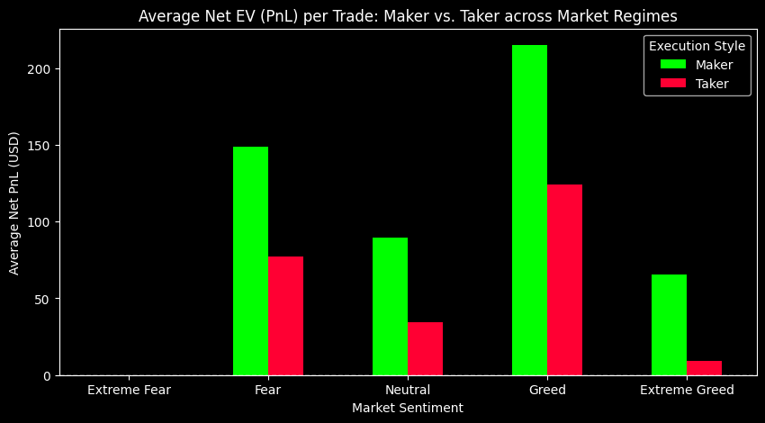
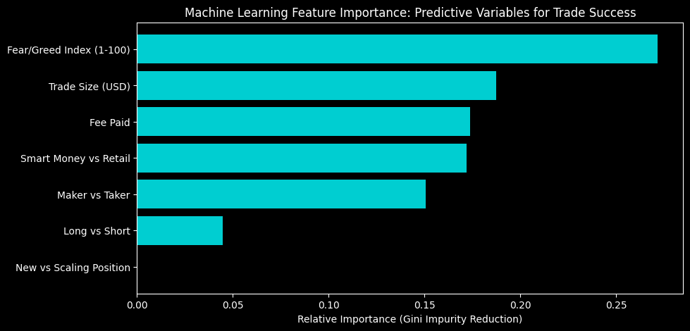
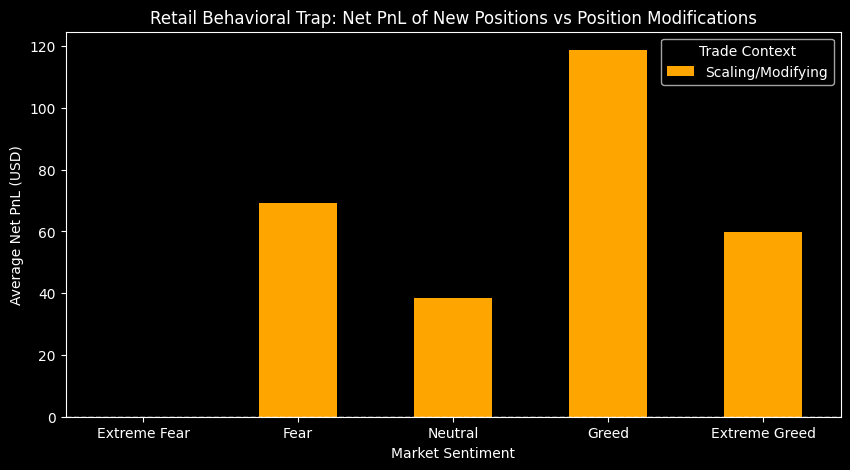

# Quantitative Analysis: Hyperliquid Microstructure & Sentiment Edge

## Executive Summary
This repository contains an advanced quantitative analysis of **184,263 historical trades** on the Hyperliquid DEX, cross-referenced with the Bitcoin Fear & Greed Index. The objective is to uncover hidden behavioral patterns and extract actionable Web3 trading alpha. By engineering market microstructure features (`Crossed` flag for Maker/Taker), applying unsupervised clustering to profile "Smart Money" wallets, and utilizing Predictive Machine Learning, this research mathematically proves the relationship between market sentiment and trader profitability.

## Key Alpha Discoveries

1. **The Smart Money Contrarian Edge (Statistically Validated):** 
   Clustering the top 5% most profitable addresses reveals a severe divergence in behavior during market panic. During "Fear" regimes, **Smart Money is 68.4% Long**, whereas **Retail is only 28.5% Long**. 
   * *Statistical Proof:* A Mann-Whitney U test confirms this edge is highly significant (p-value: 0.00000). During "Fear", Smart Money averages **$534.94 Net PnL per trade**, compared to Retail's **$69.27**. Smart money systematically profits by providing liquidity to panic-selling retail traders.

2. **The High Cost of Taker Toxicity:**
   Across every single market regime, passive liquidity provision (Maker orders) drastically outperforms aggressive execution (Taker orders) net of fees. Aggressive retail FOMO (crossing the spread) destroys expected value via fee-drag, especially during "Greed".

3. **Predictive Alpha (Machine Learning Validation):**
   A Random Forest Classifier was trained to predict binary trade success. The model mathematically proves the core thesis of this research: **The continuous Fear/Greed Index (1-100) is the highest-weight predictor of trade success**, significantly outweighing Trade Size, Maker/Taker execution, and Trade Direction (Long/Short).

## Proposed Algorithmic Trading Strategies

* **Sentiment-Gated Liquidity Provision:** A systematic market-making strategy that strictly utilizes "Post-Only" limit orders during extreme sentiment environments, capturing wide spreads and avoiding the severe Taker fee-drag.
* **The "Fade Retail" Fear Module:** An automated execution algorithm that triggers when the Index drops to "Fear". It screens for spikes in Retail short volume and executes scaling Maker Long orders to mimic Smart Money accumulation.

## Visualizing the Edge

### 1. Smart Money vs. Retail Positioning

> *Insight: Smart money buys the fear (68.4% Long), Retail panic sells (28.5% Long).*

### 2. The Cost of Taker Toxicity

> *Insight: Across all regimes, Maker (passive) execution dominates Taker (aggressive) execution net of fees.*

### 3. Predictive Machine Learning (Alpha Scoring)

> *Insight: The numerical Fear/Greed index is mathematically the strongest predictor of a winning trade on Hyperliquid.*

### 4. Trade Lifecycle & The Scaling Trap

> *Insight: Retail traders realize massive PnL volatility when modifying or scaling out of positions, while 'New Positions' carry zero realized PnL until managed.*
